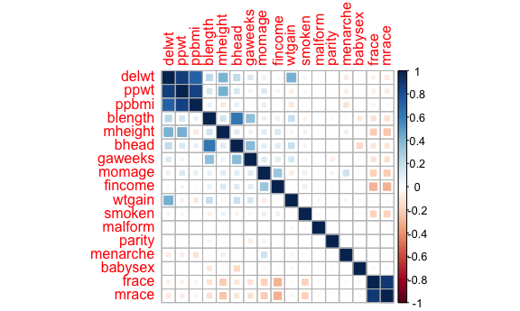
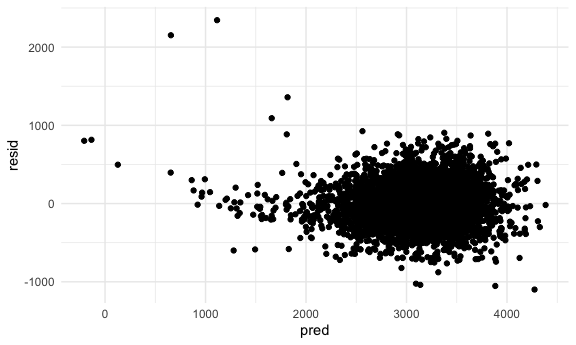
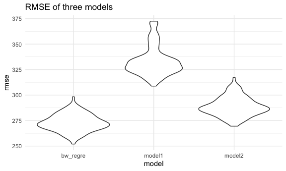
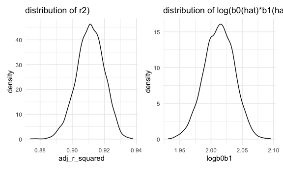

Homework6
================
Hao Zheng(hz2772)
12/2/2021

# Problem 1

## variable selection

``` r
bw_df = 
  read.csv("./data/birthweight.csv") %>%
  mutate(babysex=as.factor(babysex),
         frace=as.factor(frace),
         malform=as.factor(malform),
         mrace=as.factor(mrace)) %>%
  drop_na()
```

I have found that variables “pnumlbw” and “pnumsga” are all equal to 0,
which will be meaningless to add them into the model, so we can delete
them.

``` r
bw_df = 
  bw_df %>%
  select(-pnumlbw,-pnumsga)
bw_fit_all = lm(bwt ~.,data = bw_df)
summary(bw_fit_all)
```

    ## 
    ## Call:
    ## lm(formula = bwt ~ ., data = bw_df)
    ## 
    ## Residuals:
    ##      Min       1Q   Median       3Q      Max 
    ## -1097.68  -184.86    -3.33   173.09  2344.15 
    ## 
    ## Coefficients: (1 not defined because of singularities)
    ##               Estimate Std. Error t value Pr(>|t|)    
    ## (Intercept) -6265.3914   660.4011  -9.487  < 2e-16 ***
    ## babysex2       28.7073     8.4652   3.391 0.000702 ***
    ## bhead         130.7781     3.4523  37.881  < 2e-16 ***
    ## blength        74.9536     2.0217  37.075  < 2e-16 ***
    ## delwt           4.1007     0.3948  10.386  < 2e-16 ***
    ## fincome         0.2898     0.1795   1.614 0.106551    
    ## frace2         14.3313    46.1501   0.311 0.756168    
    ## frace3         21.2361    69.2960   0.306 0.759273    
    ## frace4        -46.9962    44.6782  -1.052 0.292912    
    ## frace8          4.2969    74.0741   0.058 0.953745    
    ## gaweeks        11.5494     1.4654   7.882 4.06e-15 ***
    ## malform1        9.7650    70.6259   0.138 0.890039    
    ## menarche       -3.5508     2.8951  -1.226 0.220083    
    ## mheight         9.7874    10.3116   0.949 0.342588    
    ## momage          0.7593     1.2221   0.621 0.534418    
    ## mrace2       -151.4354    46.0453  -3.289 0.001014 ** 
    ## mrace3        -91.3866    71.9190  -1.271 0.203908    
    ## mrace4        -56.4787    45.1369  -1.251 0.210901    
    ## parity         95.5411    40.4793   2.360 0.018307 *  
    ## ppbmi           4.3538    14.8913   0.292 0.770017    
    ## ppwt           -3.4716     2.6121  -1.329 0.183913    
    ## smoken         -4.8544     0.5871  -8.269  < 2e-16 ***
    ## wtgain              NA         NA      NA       NA    
    ## ---
    ## Signif. codes:  0 '***' 0.001 '**' 0.01 '*' 0.05 '.' 0.1 ' ' 1
    ## 
    ## Residual standard error: 272.5 on 4320 degrees of freedom
    ## Multiple R-squared:  0.7183, Adjusted R-squared:  0.717 
    ## F-statistic: 524.6 on 21 and 4320 DF,  p-value: < 2.2e-16

Put all variables into the regression model, the coefficent of “wtgain”
is NA because of singularities. Let’s check the correlations between
independent variables.

``` r
bw_var = 
  bw_df %>% 
  select(-bwt) %>%
  mutate(
    babysex=as.numeric(babysex),
    bhead=as.numeric(bhead),
    blength=as.numeric(blength),
    delwt=as.numeric(delwt),
    fincome=as.numeric(fincome),
    frace=as.numeric(frace),
    gaweeks=as.numeric(gaweeks),
    malform=as.numeric(malform),
    menarche=as.numeric(menarche),
    mheight=as.numeric(mheight),
    momage=as.numeric(momage),
    mrace=as.numeric(mrace),
    parity=as.numeric(parity),
    ppbmi=as.numeric(ppbmi),
    ppwt=as.numeric(ppwt),
    smoken=as.numeric(smoken),
    wtgain=as.numeric(wtgain)
  )
corr <- cor(bw_var)
corrplot(corr, method = "square", order = "FPC")
```



According to the plot, I find that delwt, ppwt and ppbmi have strong
correlations, frace and mrace have strong correlation. I would
manipulate variables for reasons as follow:

-   ppbmi is calculated by ppwt/(mheight)^2, I will drop the ppwt
    variable from this model.

-   delwt is calculated by ppwt+wtgain, I will drop the delwt variable
    from this midel.

-   Although mfrace and frace have strong correlations, I will keep them
    because of the interest.

## modelling

``` r
bw_regre_df = 
  bw_df %>%
  select(-ppwt,-delwt)
bw_regre_fit = lm(bwt ~.,data = bw_regre_df)
summary(bw_regre_fit)
```

    ## 
    ## Call:
    ## lm(formula = bwt ~ ., data = bw_regre_df)
    ## 
    ## Residuals:
    ##      Min       1Q   Median       3Q      Max 
    ## -1099.02  -184.80    -3.33   172.66  2344.29 
    ## 
    ## Coefficients:
    ##               Estimate Std. Error t value Pr(>|t|)    
    ## (Intercept) -6422.6097   140.1646 -45.822  < 2e-16 ***
    ## babysex2       28.7283     8.4639   3.394 0.000694 ***
    ## bhead         130.7590     3.4511  37.890  < 2e-16 ***
    ## blength        74.9539     2.0214  37.079  < 2e-16 ***
    ## fincome         0.2889     0.1795   1.610 0.107546    
    ## frace2         14.2708    46.1444   0.309 0.757136    
    ## frace3         21.3300    69.2874   0.308 0.758213    
    ## frace4        -46.8870    44.6711  -1.050 0.293959    
    ## frace8          4.0579    74.0595   0.055 0.956307    
    ## gaweeks        11.5522     1.4652   7.885 3.97e-15 ***
    ## malform1        9.8946    70.6162   0.140 0.888573    
    ## menarche       -3.5408     2.8945  -1.223 0.221289    
    ## mheight        12.2669     1.6540   7.417 1.44e-13 ***
    ## momage          0.7573     1.2220   0.620 0.535470    
    ## mrace2       -151.3744    46.0396  -3.288 0.001017 ** 
    ## mrace3        -90.9916    71.8929  -1.266 0.205704    
    ## mrace4        -56.3974    45.1307  -1.250 0.211497    
    ## parity         95.6797    40.4709   2.364 0.018115 *  
    ## ppbmi           7.9663     1.3624   5.847 5.37e-09 ***
    ## smoken         -4.8522     0.5869  -8.267  < 2e-16 ***
    ## wtgain          4.1006     0.3948  10.387  < 2e-16 ***
    ## ---
    ## Signif. codes:  0 '***' 0.001 '**' 0.01 '*' 0.05 '.' 0.1 ' ' 1
    ## 
    ## Residual standard error: 272.4 on 4321 degrees of freedom
    ## Multiple R-squared:  0.7183, Adjusted R-squared:  0.717 
    ## F-statistic:   551 on 20 and 4321 DF,  p-value: < 2.2e-16

``` r
bw_regre_fit %>% 
  broom::glance()
```

    ## # A tibble: 1 × 12
    ##   r.squared adj.r.squared sigma statistic p.value    df  logLik    AIC    BIC
    ##       <dbl>         <dbl> <dbl>     <dbl>   <dbl> <dbl>   <dbl>  <dbl>  <dbl>
    ## 1     0.718         0.717  272.      551.       0    20 -30498. 61040. 61180.
    ## # … with 3 more variables: deviance <dbl>, df.residual <int>, nobs <int>

``` r
bw_regre_fit %>% 
  broom::tidy()
```

    ## # A tibble: 21 × 5
    ##    term         estimate std.error statistic   p.value
    ##    <chr>           <dbl>     <dbl>     <dbl>     <dbl>
    ##  1 (Intercept) -6423.      140.     -45.8    0        
    ##  2 babysex2       28.7       8.46     3.39   6.94e-  4
    ##  3 bhead         131.        3.45    37.9    1.67e-271
    ##  4 blength        75.0       2.02    37.1    1.53e-261
    ##  5 fincome         0.289     0.179    1.61   1.08e-  1
    ##  6 frace2         14.3      46.1      0.309  7.57e-  1
    ##  7 frace3         21.3      69.3      0.308  7.58e-  1
    ##  8 frace4        -46.9      44.7     -1.05   2.94e-  1
    ##  9 frace8          4.06     74.1      0.0548 9.56e-  1
    ## 10 gaweeks        11.6       1.47     7.88   3.97e- 15
    ## # … with 11 more rows

This model’s adjusted R-square is 0.717, which can explain most of the
babyweight variable without the influence of strong correlations. And
variables ppbmi and wtgain have become significant variables, which
means the munipulation on correlations works. In this model, variables
babysex2, bhead, blength, gaweeks, mheight, mrace2, parity, smoken and
wtgain can be significantly contributes to the baby weight.

## Diagonostics

``` r
bw_regre_df %>%
  modelr::add_residuals(bw_regre_fit) %>%
  modelr::add_predictions(bw_regre_fit) %>% 
  ggplot(aes(x=pred, y =resid)) + geom_point()
```



From plot of residuals against fitted value, it’s clear that there are
presence of extremely large outliers in babyweight and a generally
skewed residual distribution. However, this a relatively big sample and
almost all residuals are gathering. Therefore I will keep this model as
my regression model.

## model compare

### One using length at birth and gestational age as predictors (main effects only)

``` r
model1 = lm(bwt ~ blength + gaweeks,data = bw_df)
summary(model1)
```

    ## 
    ## Call:
    ## lm(formula = bwt ~ blength + gaweeks, data = bw_df)
    ## 
    ## Residuals:
    ##     Min      1Q  Median      3Q     Max 
    ## -1709.6  -215.4   -11.4   208.2  4188.8 
    ## 
    ## Coefficients:
    ##              Estimate Std. Error t value Pr(>|t|)    
    ## (Intercept) -4347.667     97.958  -44.38   <2e-16 ***
    ## blength       128.556      1.990   64.60   <2e-16 ***
    ## gaweeks        27.047      1.718   15.74   <2e-16 ***
    ## ---
    ## Signif. codes:  0 '***' 0.001 '**' 0.01 '*' 0.05 '.' 0.1 ' ' 1
    ## 
    ## Residual standard error: 333.2 on 4339 degrees of freedom
    ## Multiple R-squared:  0.5769, Adjusted R-squared:  0.5767 
    ## F-statistic:  2958 on 2 and 4339 DF,  p-value: < 2.2e-16

This model can explain 57.67% of the babyweight, which means the
babylength and gestational age can explain more than a half of
babyweight. This is a simple and reasonable model.

### One using head circumference, length, sex, and all interactions (including the three-way interaction) between these

``` r
model2 = lm(bwt ~ bhead + blength + babysex + bhead*blength + bhead*babysex + blength*babysex + bhead*blength*babysex ,data = bw_df)
summary(model2)
```

    ## 
    ## Call:
    ## lm(formula = bwt ~ bhead + blength + babysex + bhead * blength + 
    ##     bhead * babysex + blength * babysex + bhead * blength * babysex, 
    ##     data = bw_df)
    ## 
    ## Residuals:
    ##      Min       1Q   Median       3Q      Max 
    ## -1132.99  -190.42   -10.33   178.63  2617.96 
    ## 
    ## Coefficients:
    ##                          Estimate Std. Error t value Pr(>|t|)    
    ## (Intercept)            -7176.8170  1264.8397  -5.674 1.49e-08 ***
    ## bhead                    181.7956    38.0542   4.777 1.84e-06 ***
    ## blength                  102.1269    26.2118   3.896 9.92e-05 ***
    ## babysex2                6374.8684  1677.7669   3.800 0.000147 ***
    ## bhead:blength             -0.5536     0.7802  -0.710 0.478012    
    ## bhead:babysex2          -198.3932    51.0917  -3.883 0.000105 ***
    ## blength:babysex2        -123.7729    35.1185  -3.524 0.000429 ***
    ## bhead:blength:babysex2     3.8781     1.0566   3.670 0.000245 ***
    ## ---
    ## Signif. codes:  0 '***' 0.001 '**' 0.01 '*' 0.05 '.' 0.1 ' ' 1
    ## 
    ## Residual standard error: 287.7 on 4334 degrees of freedom
    ## Multiple R-squared:  0.6849, Adjusted R-squared:  0.6844 
    ## F-statistic:  1346 on 7 and 4334 DF,  p-value: < 2.2e-16

This model can explain 68.44% of the babyweight, which is almost close
to the model with all variables included, which might indicate that
every two variables affects babyweight differently in different range of
the other variable.

## cross validation

``` r
set.seed(522)
train_df = sample_n(bw_regre_df, length(bw_regre_df[,1])*0.8)
test_df = anti_join(bw_regre_df, train_df)
```

    ## Joining, by = c("babysex", "bhead", "blength", "bwt", "fincome", "frace", "gaweeks", "malform", "menarche", "mheight", "momage", "mrace", "parity", "ppbmi", "smoken", "wtgain")

``` r
bw_regre_train = lm(bwt ~.,data = train_df)
model1_train = lm(bwt ~ blength + gaweeks,data = train_df)
model2_train = lm(bwt ~ bhead + blength + babysex + bhead*blength + bhead*babysex + blength*babysex + bhead*blength*babysex ,data = train_df)
```

## RMSE

``` r
rmse(bw_regre_train, test_df)
```

    ## [1] 277.4373

``` r
rmse(model1_train, test_df)
```

    ## [1] 325.8126

``` r
rmse(model2_train, test_df)
```

    ## [1] 294.6414

## modelr

``` r
cv_df = 
  crossv_mc(bw_regre_df, 100) 

cv_df =
  cv_df %>% 
  mutate(
    train = map(train, as_tibble),
    test = map(test, as_tibble))

cv_df = 
  cv_df %>% 
  mutate(
    bw_regre_train = map(train, ~lm(bwt ~ ., data = .x)),
    model1_train = map(train, ~lm(bwt ~ blength + gaweeks,data = .x)),
    model2_train = map(train, ~lm(bwt ~ bhead + blength + babysex + bhead*blength + bhead*babysex + blength*babysex + bhead*blength*babysex ,data = .x))) %>% 
  mutate(
    rmse_bw_regre = map2_dbl(bw_regre_train, test, ~rmse(model = .x, data = .y)),
    rmse_model1 = map2_dbl(model1_train, test, ~rmse(model = .x, data = .y)),
    rmse_model2 = map2_dbl(model2_train, test, ~rmse(model = .x, data = .y)))

cv_df %>% 
  select(starts_with("rmse")) %>% 
  pivot_longer(
    everything(),
    names_to = "model", 
    values_to = "rmse",
    names_prefix = "rmse_") %>% 
  mutate(model = fct_inorder(model)) %>% 
  ggplot(aes(x = model, y = rmse)) + geom_violin()+
  labs(title="RMSE of three models")
```



According to RMSE and residual plots of three different models, my
regression model has smallest RMSE which might result from more
independent variables in this model. The second smallest RMSE belongs to
the model with interactions, which indicates the babyweight can be
better predicted with consideration of variable interactions. The most
simple model has biggest RMSE and most unsymmetrical residual plot,
which means the baby length and gestational age can not predict baby
weight accurately.

# Problem 2

## data import

``` r
weather_df = 
  rnoaa::meteo_pull_monitors(
    c("USW00094728"),
    var = c("PRCP", "TMIN", "TMAX"), 
    date_min = "2017-01-01",
    date_max = "2017-12-31") %>%
  mutate(
    name = recode(id, USW00094728 = "CentralPark_NY"),
    tmin = tmin / 10,
    tmax = tmax / 10) %>%
  select(name, id, everything())
```

    ## Registered S3 method overwritten by 'hoardr':
    ##   method           from
    ##   print.cache_info httr

    ## using cached file: ~/Library/Caches/R/noaa_ghcnd/USW00094728.dly

    ## date created (size, mb): 2021-10-05 20:08:04 (7.602)

    ## file min/max dates: 1869-01-01 / 2021-10-31

## bootstrap

``` r
boot_straps = 
  weather_df %>% 
  modelr::bootstrap(n = 5000)
```

``` r
r2 = 
  boot_straps %>% 
  mutate(
    models = map(strap, ~lm(tmax ~ tmin, data = .x)),
    results = map(models, broom::glance)) %>% 
  unnest(results) %>%
  janitor::clean_names() %>%
  select(adj_r_squared) 

r2_p = 
  r2 %>% 
  ggplot(aes(x = adj_r_squared)) + 
  geom_density(alpha = .5) + 
  theme(legend.position = "none") +
  labs(title = "distribution of r2)")


logb0b1 =
  boot_straps %>% 
  mutate(
    models = map(strap, ~lm(tmax ~ tmin, data = .x) ),
    results = map(models, broom::tidy)) %>% 
  unnest(results) %>%
  select(term,.id,estimate) %>%
  pivot_wider(
    names_from = "term",
    values_from = "estimate"
  ) %>%
  janitor::clean_names() %>%
  mutate(logb0b1 = log((intercept)*tmin)) %>%
  select(logb0b1) 

logb0b1_p = 
  logb0b1 %>% 
  ggplot(aes(x = logb0b1)) + 
  geom_density(alpha = .5) + 
  theme(legend.position = "none") +
  labs(title = "distribution of log(b0(hat)*b1(hat))")

r2_p + logb0b1_p
```



According to the distribution plots of two estimates, it’s obvious that
they both follow the normal distribution. the mean of adjusted r2 and
log(b0b1) are 0.9112145 and 2.0128634, and the sd of adjusted r2 and
log(b0b1) are 0.0084897 and 0.0239905.

## confidence interval

``` r
r2_ci=
  r2 %>%
  summarize(
    ci_lower = quantile(adj_r_squared, 0.025), 
    ci_upper = quantile(adj_r_squared, 0.975))

logb0b1_ci = 
  logb0b1%>%
  summarize(
    ci_lower = quantile(logb0b1, 0.025), 
    ci_upper = quantile(logb0b1, 0.975))
```

The 95% confidence interval for r̂ 2 is (0.8937493, 0.9269259), The 95%
confidence interval for log(β̂ 0∗β̂ 1) is( 1.9650701, 2.0581256).
